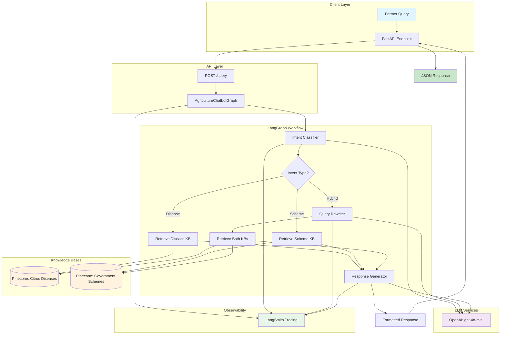
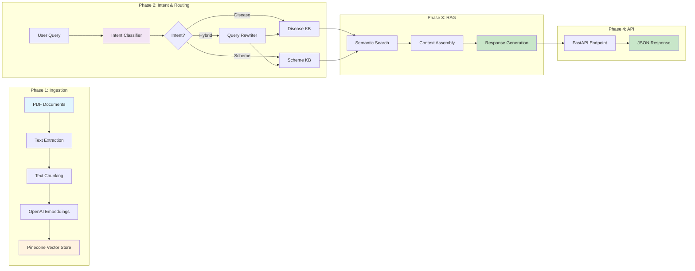
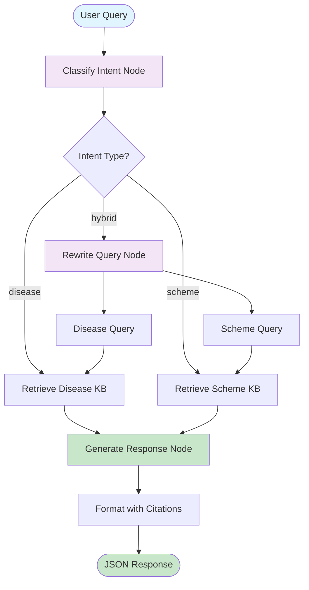
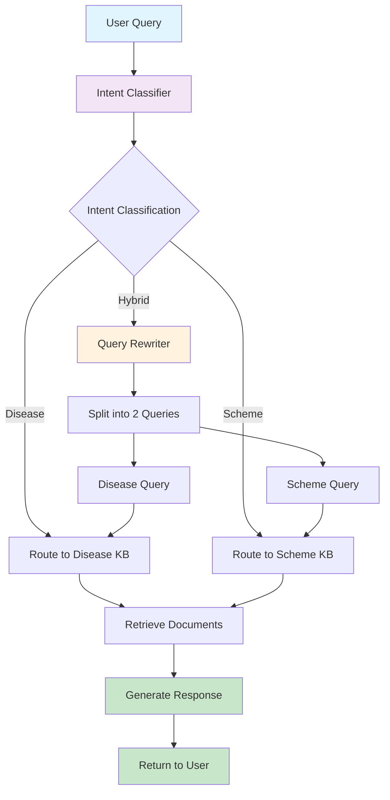

# Agriculture Chatbot for Farmers

## Deployed URL 
https://agriculture-chatbot-p23b.onrender.com/


## Video Link 
https://youtu.be/iyFT_ggFDKQ

An intelligent backend application using FastAPI that helps farmers get accurate information about citrus diseases and government agricultural schemes through a conversational interface. Built with LangChain, LangGraph, and LangSmith for observability.

## 📋 Table of Contents

- [Project Overview](#project-overview)
- [Architecture](#architecture)
- [Setup and Installation](#setup-and-installation)
- [Deployment to Render](#-deployment-to-render)
- [Environment Variables](#environment-variables)
- [API Documentation](#api-documentation)
- [LangChain/LangGraph Workflow](#langchainlanggraph-workflow)
- [Intent Detection and Routing](#intent-detection-and-routing)
- [LangSmith Observability](#-langsmith-observability)
- [Vector Database Choice](#vector-database-choice)
- [Chunking Strategy](#chunking-strategy)
- [Challenges and Solutions](#challenges-and-solutions)
- [Performance Optimization](#performance-optimization)
- [Future Improvements](#future-improvements)

---

## 🎯 Project Overview

### Objectives

This project aims to build an **Agentic RAG (Retrieval Augmented Generation)** system that:

1. **Understands farmer intent** from natural language queries
2. **Dynamically routes queries** to appropriate knowledge bases
3. **Retrieves relevant information** accurately from vector stores
4. **Returns helpful, context-aware responses** with proper citations

### Problem Statement

Farmers need quick, accurate answers to their queries about:
- **Citrus crop diseases**, symptoms, and management
- **Government agricultural schemes** and benefits
- **Combination of both** (e.g., "What schemes can help me manage Citrus Canker?")

### Solution

An intelligent chatbot that:
- Classifies queries into three intent categories (Disease, Scheme, Hybrid)
- Routes to appropriate knowledge bases using LangGraph
- Retrieves relevant context using semantic search
- Generates farmer-friendly responses with source citations

---

## 🏗️ Architecture

### System Architecture Diagram



### Component Architecture



---

## 🚀 Setup and Installation

### Prerequisites

- **Python 3.9+**
- **Virtual environment** (venv/conda)
- **API Keys**:
  - Pinecone API key
  - OpenAI API key (for embeddings and LLM)
  - LangSmith API key (optional, for observability)

### Step 1: Clone and Setup

```bash
# Clone the repository
git clone <repository-url>
cd hack2hire_hackathon

# Create virtual environment
python -m venv venv
source venv/bin/activate  # On Windows: venv\Scripts\activate

# Install dependencies
pip install -r requirements.txt
```

### Step 2: Configure Environment

```bash
# Copy example environment file
cp .env.example .env

# Edit .env with your API keys
nano .env  # or use your preferred editor
```

### Step 3: Ingest Documents

```bash
# Run the ingestion pipeline
python ingest.py
```

This will:
- Load and parse text documents
- Chunk documents intelligently
- Generate embeddings
- Store in Pinecone vector database

### Step 4: Start the API Server

```bash
# Start FastAPI server
python api.py

# Or using uvicorn directly
uvicorn api:app --host 0.0.0.0 --port 8000 --reload
```

The API will be available at:
- **API**: http://localhost:8000
- **Swagger Docs**: http://localhost:8000/docs
- **ReDoc**: http://localhost:8000/redoc
- **Health Check**: http://localhost:8000/health

---

## 🚀 Deployment to Render

### Prerequisites
- Render account ([sign up here](https://render.com))
- All environment variables ready (see [Environment Variables](#-environment-variables))

### Steps

1. **Push your code to GitHub**
   ```bash
   git add .
   git commit -m "Deploy to Render"
   git push origin main
   ```

2. **Create a new Web Service on Render**
   - Go to [Render Dashboard](https://dashboard.render.com)
   - Click "New +" → "Web Service"
   - Connect your GitHub repository
   - Select the repository containing this project

3. **Configure the service**
   - **Name**: `agriculture-chatbot` (or your preferred name)
   - **Environment**: `Docker`
   - **Region**: Choose closest to your users
   - **Branch**: `main` (or your deployment branch)
   - **Root Directory**: Leave empty (or specify if code is in subdirectory)
   - **Dockerfile Path**: `Dockerfile`
   - **Docker Context**: `.` (root directory)

4. **Set Environment Variables**
   In Render dashboard, go to "Environment" tab and add:
   ```
   PINECONE_API_KEY=your_pinecone_api_key
   OPENAI_API_KEY=your_openai_api_key
   LANGSMITH_TRACING=true (optional)
   LANGSMITH_API_KEY=your_langsmith_api_key (optional)
   LANGSMITH_WORKSPACE_ID=your_workspace_id (optional)
   LANGSMITH_PROJECT=agriculture-chatbot (optional)
   PORT=8000
   HOST=0.0.0.0
   ```

5. **Deploy**
   - Click "Create Web Service"
   - Render will build and deploy your Docker image
   - Build logs will show progress
   - Service will be available at: `https://your-service-name.onrender.com`

6. **Access your deployed API**
   - **API**: `https://your-service-name.onrender.com`
   - **Swagger Docs**: `https://your-service-name.onrender.com/docs`
   - **Health Check**: `https://your-service-name.onrender.com/health`


---

## 🔐 Environment Variables

All environment variables are documented in `.env.example`. Here's a summary:

### Required Variables

| Variable | Description | Where to Get |
|----------|-------------|--------------|
| `PINECONE_API_KEY` | Pinecone vector database API key | [app.pinecone.io](https://app.pinecone.io/) |
| `OPENAI_API_KEY` | OpenAI API key for embeddings and LLM | [platform.openai.com](https://platform.openai.com/api-keys) |

### Optional Variables

| Variable | Description | Default |
|----------|-------------|---------|
| `LANGSMITH_TRACING` | Enable LangSmith observability | `false` |
| `LANGSMITH_API_KEY` | LangSmith API key | - |
| `LANGSMITH_WORKSPACE_ID` | LangSmith workspace ID | - |
| `LANGSMITH_PROJECT` | LangSmith project name | `agriculture-chatbot` |
| `PORT` | FastAPI server port | `8000` |
| `HOST` | FastAPI server host | `0.0.0.0` |
| `PINECONE_ENVIRONMENT` | Pinecone environment | `gcp-starter` |

### Example `.env` File

```bash
# Vector Database
PINECONE_API_KEY=your_pinecone_api_key_here

# OpenAI (for embeddings and LLM)
OPENAI_API_KEY=your_openai_api_key_here

# LangSmith (optional)
LANGSMITH_TRACING=true
LANGSMITH_API_KEY=your_langsmith_api_key_here

# Server Configuration
PORT=8000
HOST=0.0.0.0
```

---

## 📡 API Documentation


### Endpoints

####  Query Endpoint

**POST** `/query`

Process a farmer's query about citrus diseases or government schemes.

**Request Body:**
```json
{
  "question": "What government schemes are available for citrus farmers in Andhra Pradesh?",
  "thread_id": "user-123-session-1"  // Optional: for conversation history
}
```

**Response:**
```json
{
  "success": true,
  "intent": "scheme",
  "answer": "Several government schemes are available for citrus farmers in Andhra Pradesh: 1) Pradhan Mantri Krishi Sinchai Yojana (PMKSY)...",
  "confidence": 0.95,
  "reasoning": "Query focuses on government schemes and subsidies",
  "num_disease_docs": 0,
  "num_scheme_docs": 3
}
```

### Example Requests

#### Disease Intent

```bash
curl -X POST "http://localhost:8000/query" \
  -H "Content-Type: application/json" \
  -d '{
    "question": "My citrus leaves are showing yellow blotchy patches. What could this be?"
  }'
```

**Expected Response:**
```json
{
  "success": true,
  "intent": "disease",
  "answer": "The yellow blotchy patches on your citrus leaves could indicate Huanglongbing (HLB) or Citrus Greening disease...",
  "confidence": 0.92,
  "num_disease_docs": 3,
  "num_scheme_docs": 0
}
```

**Expected Response:**
```json
{
  "success": true,
  "intent": "hybrid",
  "answer": "Yes, drip irrigation helps prevent root diseases and government support is available:\n\nDISEASE PREVENTION BENEFITS:\nDrip irrigation significantly reduces Phytophthora foot rot...\n\nGOVERNMENT SUBSIDY:\nPradhan Mantri Krishi Sinchai Yojana (PMKSY)...",
  "confidence": 0.88,
  "num_disease_docs": 2,
  "num_scheme_docs": 3
}
```

## 🔄 LangChain/LangGraph Workflow

### Workflow Diagram



### Workflow Steps

1. **Intent Classification** (`classify_intent_node`)
   - Analyzes user query using LLM
   - Classifies into: `disease`, `scheme`, or `hybrid`
   - Returns confidence score and reasoning

2. **Query Rewriting** (`rewrite_query_node`) - *Only for hybrid intents*
   - Splits hybrid query into two focused queries
   - Disease-focused query for disease KB
   - Scheme-focused query for scheme KB

3. **Document Retrieval** (`retrieve_and_generate_node`)
   - Performs semantic search in appropriate vector store(s)
   - Retrieves top-k documents (k=5)
   - Formats context with citations

4. **Response Generation** (`retrieve_and_generate_node`)
   - Generates farmer-friendly response using LLM
   - Includes source citations with page numbers
   - Includes confidence scores

## 🎯 Intent Detection and Routing

### Intent Categories

#### 1. Disease Intent → Routes to Citrus Pests & Diseases KB

**Characteristics:**
- Queries about disease symptoms and identification
- Pest problems and infestations
- Treatment and prevention methods
- Nutritional deficiencies
- Plant health issues

**Examples:**
- "My citrus leaves are showing yellow blotchy patches. What could this be?"
- "How do I prevent Citrus Canker in my orchard?"
- "What treatment should I use for whitefly infestation?"

#### 2. Scheme Intent → Routes to Government Schemes KB

**Characteristics:**
- Queries about government subsidies and financial assistance
- Agricultural support programs
- Eligibility criteria for schemes
- Application processes
- Available benefits for farmers

**Examples:**
- "What government schemes are available for citrus farmers in Andhra Pradesh?"
- "Are there any subsidies for setting up drip irrigation?"
- "How can I get financial help to start organic citrus farming?"

#### 3. Hybrid Intent → Routes to BOTH Knowledge Bases

**Characteristics:**
- Financial support for disease management
- Schemes that help with specific pest control
- Government assistance combined with agricultural problems
- Any query connecting schemes with diseases/pests

**Examples:**
- "Can I get government support for setting up drip irrigation to prevent root diseases?"
- "What schemes can help me manage Citrus Canker?"
- "Tell me about Citrus Canker and available government schemes"

### Routing Logic Flow



### Implementation Details

The intent classifier uses:
- **LLM**: OpenAI `gpt-4o-mini` model
- **Structured Output**: Pydantic models with function calling for type safety

**Confidence Thresholds:**
- High confidence (>0.8): Direct routing
- Medium confidence (0.6-0.8): Routing with caution
- Low confidence (<0.6): Fallback to keyword-based classification

---

## 📊 LangSmith Observability

The application uses LangSmith for end-to-end observability and tracing of the LangGraph workflow. This allows you to monitor and debug the entire agentic flow.

### Setup

1. **Create a LangSmith account** at [smith.langchain.com](https://smith.langchain.com)
2. **Get your API key** from the settings page
3. **Set environment variables**:
   ```bash
   LANGSMITH_TRACING=true
   LANGSMITH_API_KEY=your_api_key_here
   LANGSMITH_WORKSPACE_ID=your_workspace_id
   LANGSMITH_PROJECT=agriculture-chatbot
   ```

### Trace Visualization

LangSmith provides detailed traces showing:
- **Intent Classification**: Query analysis and intent detection
- **Query Rewriting**: Hybrid query splitting (when applicable)
- **Document Retrieval**: Semantic search and retrieval steps
- **Response Generation**: LLM response generation with context
- **Timing Metrics**: Latency for each step
- **Token Usage**: Token consumption per operation

### Example Trace


The trace shows a complete workflow execution for a hybrid intent query, including:
- Intent classification (8.17s, 1,711 tokens)
- Query rewriting (4.06s, 1,400 tokens)
- Document retrieval from both knowledge bases (3.18s + 2.82s)
- Response generation (18.39s, 2,575 tokens)
- Total workflow time: 36.66s with 5,686 tokens

### Viewing Traces

1. Go to [LangSmith Dashboard](https://smith.langchain.com)
2. Navigate to "Tracing" section
3. Select your project (`agriculture-chatbot`)
4. View individual traces with full details

---

## 🗄️ Vector Database Choice

### Why Pinecone?

We chose **Pinecone** as our vector database for the following reasons:

#### 1. **Managed Service**
- No infrastructure management required
- Automatic scaling and optimization
- High availability and reliability

#### 2. **Performance**
- Sub-100ms query latency
- Optimized for similarity search
- Efficient indexing algorithms

#### 3. **Ease of Integration**
- Native LangChain integration (`langchain-pinecone`)
- Simple API for operations
- Good documentation and community support

#### 4. **Scalability**
- Handles millions of vectors
- Serverless option for cost efficiency
- Pay-as-you-go pricing model

#### 5. **Features**
- Metadata filtering
- Namespace support (separate collections)
- Real-time updates

### Alternative Considerations

| Database | Pros | Cons | Why Not Chosen |
|----------|------|------|----------------|
| **Chroma** | Open-source, local | Requires self-hosting, less scalable | Need managed solution |
| **Qdrant** | Open-source, good performance | Requires setup and maintenance | Prefer managed service |
| **FAISS** | Fast, Facebook-backed | In-memory only, no persistence | Need persistent storage |


### Separate Collections

We use two separate Pinecone indexes:
1. **`citrus-diseases-pests`**: Citrus disease and pest information
2. **`government-schemes`**: Government agricultural schemes

This separation allows:
- Independent scaling
- Targeted retrieval
- Better organization
- Easier maintenance

---

## 📄 Chunking Strategy

### Strategy Overview

We use **RecursiveCharacterTextSplitter** with intelligent separators for optimal chunking.

### Why This Strategy?

#### 1. **Semantic Coherence**
- Preserves paragraph boundaries
- Maintains context within chunks
- Reduces information fragmentation

#### 2. **Overlap Benefits**
- Ensures continuity between chunks
- Prevents information loss at boundaries
- Improves retrieval for edge cases

#### 3. **Size Optimization**
- 1000 tokens: Balance between context and specificity
- Large enough for complete thoughts
- Small enough for precise retrieval

#### 4. **Table Handling**
- Tables converted to natural language sentences
- Each row becomes a "mini-document"
- Example: "MIDH Year-1 subsidy for 'Plant Material': unit cost ₹16,500, 60% subsidy (₹9,900), farmer share 40% (₹6,600)."

### Chunking Process Flow


### Metadata Added to Chunks

```python
{
    "source": "CitrusPlantPestsAndDiseases.txt",
    "collection": "citrus_diseases_pests",
    "chunk_id": 0,
    "total_chunks": 150,
    "page_number": 1  # If available
}
```

---

## 🛠️ Challenges and Solutions

### Challenge 1: Embedding Dimension Mismatch

**Problem:**
- Switched from HuggingFace (384D) to OpenAI (1536D) embeddings
- Existing Pinecone indexes had wrong dimensions
- Queries failed with dimension mismatch errors

**Solution:**
Implemented automatic dimension detection and index recreation:

```python
def create_pinecone_index(pc, index_name, dimension=1536):
    existing_indexes = [index.name for index in pc.list_indexes()]
    
    if index_name in existing_indexes:
        index_info = pc.describe_index(index_name)
        if index_info.dimension != dimension:
            # Delete and recreate with correct dimension
            pc.delete_index(index_name)
            # Wait for deletion...
            pc.create_index(name=index_name, dimension=dimension, ...)
```

### Challenge 2: Document Serialization in LangGraph

**Problem:**
- `Document` objects cannot be serialized by `InMemorySaver`
- Checkpointer fails when storing state with Document objects
- Need to preserve documents for response formatting

**Solution:**
Temporary storage pattern:
- Store documents in instance variable during graph execution
- Add to result after `invoke()` completes
- Clear temporary storage after use

```python
# Store temporarily (not in checkpointer state)
self._temp_retrieval_result = {
    "disease_docs": result.get("disease_docs"),
    "scheme_docs": result.get("scheme_docs")
}

# Add to result after invoke
result["disease_docs"] = self._temp_retrieval_result.get("disease_docs")
```

### Challenge 3: Table Data Formatting

**Problem:**
- PDF tables need conversion to natural language
- Raw table data not suitable for embeddings
- Need to preserve semantic meaning

**Solution:**
Row-to-sentence conversion:
- Convert each table row to a natural language sentence
- Include both keys and values
- Example: "MIDH Year-1 subsidy for 'Plant Material': unit cost ₹16,500, 60% subsidy (₹9,900), farmer share 40% (₹6,600)."

---

## ⚡ Performance Optimization

### 1. **Singleton Pattern for Chatbot Graph**

```python
# Initialize once, reuse for all requests
chatbot_graph = None

def get_chatbot():
    global chatbot_graph
    if chatbot_graph is None:
        chatbot_graph = AgricultureChatbotGraph()
    return chatbot_graph
```

**Benefits:**
- Reduces initialization overhead
- Faster response times
- Lower memory usage

### 2. **Retrieval Optimization**

- Initial retrieval: k=5 documents
- Reduces LLM context size
- Improves response quality

### 3. **Embedding Caching**

- OpenAI embeddings are cached by LangChain
- Redundant queries use cached embeddings
- Faster retrieval for similar queries

### 4. **Conversation History Limiting**

```python
# Only include last 3 messages in context
for msg in conversation_history[-3:]:
    # Process message
```

**Benefits:**
- Prevents context window overflow
- Faster LLM processing
- Lower token costs

### 5. **Parallel Retrieval for Hybrid Queries**

```python
# Retrieve from both KBs in parallel (if possible)
disease_docs = self.retrieve_disease(disease_query, k)
scheme_docs = self.retrieve_scheme(scheme_query, k)
```

### 6. **Lazy Initialization**

- Components initialized only when needed
- Vector stores created on first use
- Reduces startup time

---

## 🚀 Future Improvements

### 1. **Enhanced Edge Case Handling**

- **Confidence Thresholds**: Filter low-confidence results
- **Conflict Detection**: Identify and resolve conflicting information
- **Ambiguity Resolution**: Ask clarifying questions for ambiguous queries

### 2. **Advanced Reranking**

- **Cross-encoder Models**: More accurate reranking
- **Query Expansion**: Improve retrieval with expanded queries
- **Hybrid Search**: Combine semantic and keyword search

### 3. **Caching Layer**

- **Response Caching**: Cache common queries
- **Embedding Caching**: Already implemented, can be enhanced
- **Redis Integration**: Distributed caching for scalability

### 4. **Multi-language Support**

- **Translation Layer**: Support regional languages
- **Multilingual Embeddings**: Better cross-language retrieval
- **Localized Responses**: Responses in farmer's language

### 5. **Enhanced Observability**

- **Custom Metrics**: Track intent accuracy, response quality
- **A/B Testing**: Test different models/prompts
- **Performance Monitoring**: Track latency, error rates

### 6. **Scalability Improvements**

- **Async Processing**: Async/await for I/O operations
- **Batch Processing**: Process multiple queries in batch
- **Load Balancing**: Distribute load across instances

### 7. **Advanced Features**

- **Voice Input**: Support voice queries
- **Image Analysis**: Analyze disease symptoms from images
- **Recommendation System**: Proactive suggestions based on context
- **Integration with Government Portals**: Direct scheme application links

### 8. **Model Improvements**

- **Fine-tuning**: Fine-tune models on agricultural domain
- **Ensemble Models**: Combine multiple models for better accuracy
- **Specialized Models**: Disease-specific and scheme-specific models

### 9. **Security Enhancements**

- **Rate Limiting**: Prevent abuse
- **Authentication**: User authentication and authorization
- **Input Validation**: Enhanced input sanitization
- **API Key Management**: Secure key storage

### 10. **Documentation and Testing**

- **Unit Tests**: Comprehensive test coverage
- **Integration Tests**: End-to-end testing
- **Performance Tests**: Load and stress testing
- **API Versioning**: Support multiple API versions

---

## 📊 Project Structure

```
hack2hire_hackathon/
├── api.py                 # FastAPI backend endpoints
├── main.py                # LangGraph workflow orchestration
├── intent_classifier.py   # Intent classification logic
├── query_rewriter.py     # Query rewriting for hybrid intents
├── retrieve.py            # RAG retrieval and generation
├── response.py            # Response generation with LLM
├── ingest.py              # Document ingestion pipeline
├── requirements.txt       # Python dependencies
├── .env.example          # Environment variables template
├── README.md             # This file
├── CitrusPlantPestsAndDiseases.txt  # Disease knowledge base
├── GovernmentSchemes.txt            # Scheme knowledge base
└── venv/                 # Virtual environment
```

---

## 🧪 Testing

### Test Queries

#### Disease Intent
```bash
curl -X POST "http://localhost:8000/query" \
  -H "Content-Type: application/json" \
  -d '{"question": "My citrus leaves are showing yellow blotchy patches. What could this be?"}'
```

#### Scheme Intent
```bash
curl -X POST "http://localhost:8000/query" \
  -H "Content-Type: application/json" \
  -d '{"question": "What government schemes are available for citrus farmers in Andhra Pradesh?"}'
```

#### Hybrid Intent
```bash
curl -X POST "http://localhost:8000/query" \
  -H "Content-Type: application/json" \
  -d '{"question": "Can I get government support for setting up drip irrigation to prevent root diseases?"}'
```

---

## 📝 License

This project is developed for the Agriculture Chatbot Hackathon.

---

## 👥 Contributors

- Developed for FiduraAI Hackathon
- Position: Full Stack Engineer (Backend Developer)

---

## 📞 Support

For questions or issues:
- **Email**: support@alumnx.com
- **Submission Form**: [Hackathon Submission](https://docs.google.com/forms/d/e/1FAIpQLSfmO91ttMW1_JPvIcjvGyGeTK6E5siGfDYUJyrhz0W7vlr_cw/viewform)

---

## 🙏 Acknowledgments

- **LangChain/LangGraph**: For agentic AI framework
- **Pinecone**: For vector database infrastructure
- **OpenAI**: For embedding models and LLM
- **LangSmith**: For observability and tracing
- **FastAPI**: For modern Python web framework

---

**Built with ❤️ for farmers**

